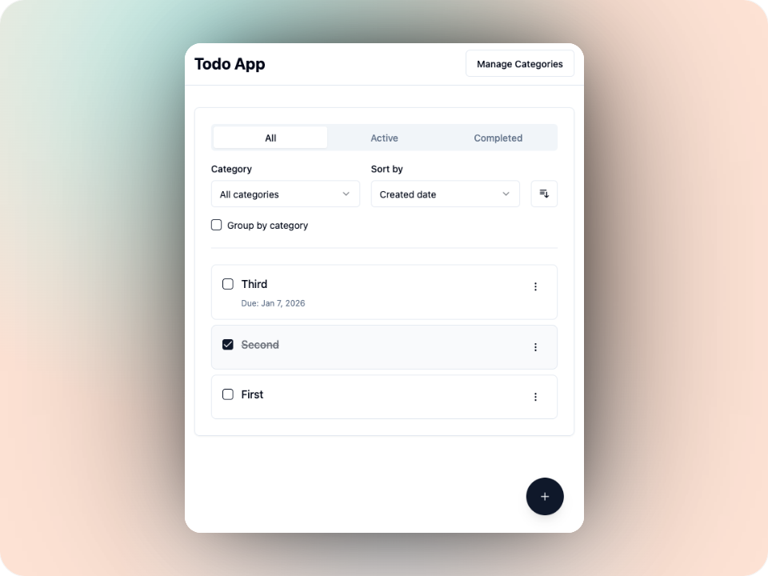

# Todo App

A modern full-stack todo application using Node.js native TypeScript support, Express, React, and Redux.



## Tech Stack

| Layer | Technology |
|-------|------------|
| **Runtime** | Node.js 24.12+ (LTS) with native TypeScript |
| **Backend** | Express.js |
| **Database** | SQLite with Prisma ORM |
| **Frontend** | React 18, Redux Toolkit |
| **UI Components** | shadcn/ui, Radix UI |
| **Styling** | Tailwind CSS |
| **Bundler** | Vite |
| **Package Manager** | Yarn 4 (Berry) |
| **Testing** | Jest, React Testing Library, Selenium WebDriver |

## Documentation

| Document | Description |
|----------|-------------|
| [docs/API.md](docs/API.md) | REST API endpoints, request/response schemas, validation rules |
| [docs/DATABASE_SCHEMA.md](docs/DATABASE_SCHEMA.md) | Database tables, Prisma schema, queries |
| [docs/USER_STORIES.md](docs/USER_STORIES.md) | Feature requirements and user stories |

## Project Structure

```
todo-app/
├── src/
│   ├── backend/
│   │   ├── server.ts              # Express server entry point
│   │   ├── routes/
│   │   │   ├── categories.ts      # Category CRUD endpoints
│   │   │   └── todos.ts           # Todo CRUD endpoints
│   │   ├── middleware/
│   │   │   └── errorHandler.ts    # Error handling middleware
│   │   ├── validation/
│   │   │   └── schemas.ts         # Zod validation schemas
│   │   └── db/
│   │       └── client.ts          # Prisma client singleton
│   └── frontend/
│       ├── index.tsx              # React entry point
│       ├── App.tsx                # Root component
│       ├── globals.css            # Tailwind CSS + shadcn theme
│       ├── components/
│       │   └── ui/                # shadcn/ui components
│       │       ├── button.tsx
│       │       └── card.tsx
│       ├── lib/
│       │   └── utils.ts           # Utility functions (cn)
│       └── store/
│           ├── index.ts           # Redux store configuration
│           ├── todosSlice.ts      # Todo state & async thunks
│           └── categoriesSlice.ts # Category state & async thunks
├── tests/
│   ├── backend/
│   │   └── *.test.ts              # API endpoint tests
│   └── frontend/
│       ├── unit/                  # React component tests
│       ├── integration/
│       │   ├── setup/             # Server, driver, database helpers
│       │   ├── factories/         # Faker.js data generators
│       │   ├── scenarios/         # Predefined test data scenarios
│       │   ├── helpers/           # Selectors, actions, assertions
│       │   └── specs/             # Integration test specs
│       └── setupTests.ts
├── docs/                           # Documentation
│   ├── API.md                      # REST API specification
│   ├── DATABASE_SCHEMA.md          # Database schema
│   ├── FRONTEND.md                 # Frontend architecture
│   └── USER_STORIES.md             # Feature requirements
├── dist/frontend/                  # Built frontend assets (Vite output)
├── components.json                 # shadcn/ui configuration
├── tailwind.config.cjs             # Tailwind CSS configuration
├── postcss.config.cjs              # PostCSS configuration
├── vite.config.ts                  # Vite configuration
├── package.json
├── tsconfig.json                   # Base TypeScript config
├── tsconfig.backend.json           # Backend TypeScript config
├── tsconfig.frontend.json          # Frontend TypeScript config
├── jest.backend.config.cjs         # Jest config for backend
├── jest.frontend.config.cjs        # Jest config for frontend
├── jest.integration.config.cjs     # Jest config for Selenium tests
├── Dockerfile                      # Docker container for CI
└── .github/workflows/ci.yml        # GitHub Actions CI pipeline
```

## Getting Started

### Prerequisites

- Node.js 24.12.0 (LTS) or later
- Yarn (will be auto-installed via Corepack)

### Installation

```bash
# Enable Corepack (for Yarn)
corepack enable

# Install dependencies
yarn install

# Build the frontend
yarn build:frontend
```

### Running the Application

```bash
# Production
yarn start

# Development (both backend and frontend with hot reload)
yarn dev
```

### Development Ports

| Port | Server | Purpose |
|------|--------|---------|
| **5173** | Vite | Frontend with HMR - **use this in your browser** |
| 3000 | Express | Backend API (Vite proxies `/api` requests here) |

In development, open http://localhost:5173 for hot reload. In production, only port 3000 is used.

## Available Scripts

| Script | Description |
|--------|-------------|
| `yarn dev` | Run backend and frontend concurrently with watch mode |
| `yarn dev:backend` | Run Express server with file watching |
| `yarn dev:frontend` | Run Vite dev server |
| `yarn start` | Start production server |
| `yarn build` | Build backend and frontend |
| `yarn build:backend` | Type-check backend (no emit due to native TS) |
| `yarn build:frontend` | Bundle frontend with Vite |
| `yarn test` | Run all unit tests |
| `yarn test:backend` | Run backend API tests |
| `yarn test:frontend` | Run React component tests |
| `yarn test:integration` | Build frontend and run Selenium integration tests |
| `yarn db:migrate` | Run database migrations (development) |
| `yarn db:reset` | Drop database and reapply all migrations |
| `yarn db:studio` | Open Prisma Studio GUI |
| `yarn db:generate` | Regenerate Prisma client |

## API Endpoints

See [API.md](API.md) for full documentation including request/response schemas and validation rules.

| Method | Endpoint | Description |
|--------|----------|-------------|
| GET | `/api/categories` | List all categories |
| POST | `/api/categories` | Create a category |
| PUT | `/api/categories/:id` | Update a category |
| DELETE | `/api/categories/:id` | Delete a category |
| GET | `/api/todos` | List todos (with filtering/sorting) |
| GET | `/api/todos/:id` | Get a single todo |
| POST | `/api/todos` | Create a todo |
| PUT | `/api/todos/:id` | Update a todo |
| DELETE | `/api/todos/:id` | Delete a todo |
| PATCH | `/api/todos/:id/toggle` | Toggle todo completion |

## Frontend Routes

The frontend uses React Router with HTML5 pushstate for client-side routing. All routes are shareable and bookmarkable.

### Status Filters (path-based)

| Route | Description |
|-------|-------------|
| `/todos` | All todos |
| `/todos/active` | Active (incomplete) todos only |
| `/todos/completed` | Completed todos only |

### Category Filter (query param)

Combine with any status route:
- `/todos?category=1` - Filter by category ID
- `/todos/active?category=2` - Active todos in category 2

### Modal Routes

| Route | Description |
|-------|-------------|
| `/todos/new` | Open create todo dialog |
| `/todos/:id/edit` | Open edit dialog for specific todo |
| `/todos/active/new` | Create todo (preserves active filter) |
| `/categories` | Open category manager dialog |

## Testing

### Unit Tests

```bash
# Run all unit tests
yarn test

# Run with coverage
yarn test:backend --coverage
yarn test:frontend --coverage
```

**Backend Tests (45 tests):**

| Test File | Tests | Description |
|-----------|-------|-------------|
| `categories.test.ts` | 13 | Category CRUD endpoints |
| `todos.test.ts` | 32 | Todo CRUD, toggle, filtering, sorting |

**Frontend Tests (103 tests):**

| Test File | Tests | Description |
|-----------|-------|-------------|
| `App.test.tsx` | 8 | Router configuration and redirects |
| `TodoApp.test.tsx` | 11 | Page titles and app rendering |
| `TodoList.test.tsx` | 11 | Todo list rendering and interactions |
| `TodoItem.test.tsx` | 10 | Individual todo item behavior |
| `TodoForm.test.tsx` | 11 | Create/edit form validation |
| `TodoFilters.test.tsx` | 11 | Filter controls and state |
| `EmptyState.test.tsx` | 5 | Empty state messages |
| `CategoryForm.test.tsx` | 7 | Category form validation |
| `CategoryList.test.tsx` | 7 | Category list rendering |
| `CategoryItem.test.tsx` | 6 | Category item interactions |
| `Header.test.tsx` | 9 | Header component |
| `LoadingSpinner.test.tsx` | 4 | Loading indicator |
| `ErrorMessage.test.tsx` | 3 | Error display |

### Integration Tests

The integration tests use Selenium WebDriver with headless Chrome to test the full application stack. Test data is generated using [faker.js](https://fakerjs.dev/) for realistic scenarios.

**Prerequisites:** ChromeDriver must be installed:

```bash
# macOS
brew install chromedriver
```

**Running integration tests:**

```bash
# Run all integration tests (automatically builds frontend first)
yarn test:integration

# Run specific test file
yarn test:integration --testPathPattern=todo-crud

# Run with visible browser (for debugging)
# Edit tests/frontend/integration/setup/testDriver.ts and comment out headless mode
```

**Test Structure:**

| Directory | Purpose |
|-----------|---------|
| `setup/` | Server lifecycle, WebDriver config, database helpers |
| `factories/` | Faker.js data generators for todos and categories |
| `scenarios/` | Predefined data scenarios (empty, simple, with categories, etc.) |
| `helpers/` | Reusable selectors, UI actions, and assertions |
| `specs/` | Test specifications (todo-crud, filtering, sorting, category-crud, grouping) |

**Test Specs:**

| Spec | Tests | Description |
|------|-------|-------------|
| `todo-crud` | 11 | Create, read, update, delete, toggle todos |
| `todo-filtering` | 8 | Status and category filtering |
| `todo-sorting` | 4 | Sort by date, order toggle |
| `category-crud` | 8 | Create, delete, validate categories |
| `category-grouping` | 8 | Group by category view |

## Docker

A Dockerfile is provided for running the application and tests in a containerized environment.

```bash
# Build the Docker image
docker build -t todo-app .

# Run the application
docker run -p 3000:3000 todo-app

# Run tests in the container
docker run --rm todo-app yarn test:backend
docker run --rm todo-app yarn test:frontend
docker run --rm todo-app yarn test:integration
```

The Docker image:
- Uses Node.js 24 (Debian Bookworm)
- Includes Chromium and ChromeDriver for Selenium integration tests
- Pre-runs database migrations during build
- Supports both ARM64 and AMD64 architectures

## CI/CD

GitHub Actions is configured to run all tests on every push to any branch.

**Pipeline Steps:**
1. Build Docker image (with layer caching)
2. Run backend tests
3. Run frontend tests
4. Run integration tests

The workflow file is located at `.github/workflows/ci.yml`.

## Adding shadcn/ui Components

This project uses [shadcn/ui](https://ui.shadcn.com/) for UI components. Components are copied into `src/frontend/components/ui/`.

To add new components, either:

1. **Copy from shadcn/ui website**: Visit [ui.shadcn.com](https://ui.shadcn.com/docs/components) and copy the component code
2. **Use the CLI** (if configured): `npx shadcn@latest add <component-name>`

Path alias `@/` is configured to point to `src/frontend/`, so imports work as:
```tsx
import { Button } from '@/components/ui/button'
```

## Architecture Decisions

### Native Node.js TypeScript

This project uses Node.js 24.12+ (LTS) native TypeScript support instead of transpilation tools like ts-node. The backend code uses only erasable TypeScript syntax (type annotations, interfaces, `import type`), allowing Node.js to run `.ts` files directly by stripping types at runtime.

### ESM Modules

The project uses ES Modules (`"type": "module"` in package.json):
- Backend imports use `.ts` extensions
- Config files use `.cjs` extension for CommonJS compatibility
- Jest runs with `--experimental-vm-modules` flag

### Frontend Bundling

While the backend runs TypeScript natively, the frontend uses Vite because:
- Browsers cannot execute TypeScript or JSX directly
- Vite provides fast HMR (Hot Module Replacement) during development
- Production builds are optimized with code splitting and tree shaking

### React StrictMode

The app is wrapped in `<React.StrictMode>` which intentionally double-invokes effects in development to help detect side effects. This means you'll see duplicate API requests in the console during development - this is expected and does not occur in production builds.

## Database

The application uses SQLite with Prisma ORM. See [DATABASE_SCHEMA.md](DATABASE_SCHEMA.md) for full schema documentation.

```bash
# Run migrations
yarn db:migrate

# Open Prisma Studio (GUI)
yarn db:studio
```

## Environment Variables

| Variable | Default | Description |
|----------|---------|-------------|
| `PORT` | `3000` | Server port |
| `DATABASE_URL` | `file:./dev.db` | SQLite database path |

## License

MIT
